# Module project

I am using Oracle VM VirtualBox to make three virtual computers for a small server environment. One will be assigned to be master, and other two are minions. The operating system for the virtual computers will be Debian12 Bookworm(64).
The idea is to make a script which will install these computers, and Salt-master and Salt-minion daemons automatically. By following this report, you should be able to duplicate every single phase to make your own small virtual environment!

I use Vagrant with my hostOS, Windows. To control my virtual computers for commands, I use Vagrant SSH in Windows PowerShell.
To download and install VirtualBox and Vagrant, visit https://www.virtualbox.org/wiki/Downloads & https://developer.hashicorp.com/vagrant/install.

## Installing the VM:s, Salt-master and Salt-minion 2.12.2024 12:45-13:50

First task is to make a new project folder for the operating system, which will contain the Vagrantfile used to install and start the Virtual Machines. This happens in my user's folder (still in HostOS).

    mkdir moduleproject
    cd moduleproject

Secondly download the image for the GuestOS used in the Virtual Machines

    vagrant init debian/bookworm64

Then to make the script for installing the three computers, Salt-master and Salt-minion and assign them as master and minions. More tips https://terokarvinen.com/2023/salt-vagrant/#infra-as-code---your-wishes-as-a-text-file.
For better understanding of the repository downloads necessary for installing Salt, visit https://saltproject.io/blog/salt-project-package-repo-migration-and-guidance/.

    # This opens notepad to modify the vagrantfile
   
    notepad vagrantfile

    # Script (Starting from next line of text)
   
    # -*- mode: ruby -*-
    # vi: set ft=ruby :
    # Copyright 2014-2023 Tero Karvinen http://TeroKarvinen.com

    $minion = <<MINION
    sudo apt-get update
    sudo apt-get -qy install curl
    sudo mkdir -p /etc/apt/keyrings
    sudo curl -fsSL https://packages.broadcom.com/artifactory/api/security/keypair/SaltProjectKey/public | sudo tee /etc/apt/keyrings/salt-archive-keyring-2023.pgp
    echo "deb [signed-by=/etc/apt/keyrings/salt-archive-keyring-2023.pgp arch=amd64] https://packages.broadcom.com/artifactory/saltproject-deb/ stable main" | sudo tee /etc/apt/sources.list.d/salt.list
    sudo apt-get update
    sudo apt-get -qy install salt-minion
    echo "master: 192.168.12.3">/etc/salt/minion
    sudo systemctl restart salt-minion.service
    echo "See also: https://terokarvinen.com/2023/salt-vagrant/"
    MINION

    $master = <<MASTER
    sudo apt-get update
    sudo apt-get -qy install curl
    sudo mkdir -p /etc/apt/keyrings
    sudo curl -fsSL https://packages.broadcom.com/artifactory/api/security/keypair/SaltProjectKey/public | sudo tee /etc/apt/keyrings/salt-archive-keyring-2023.pgp
    echo "deb [signed-by=/etc/apt/keyrings/salt-archive-keyring-2023.pgp arch=amd64] https://packages.broadcom.com/artifactory/saltproject-deb/ stable main" | sudo tee /etc/apt/sources.list.d/salt.list
    sudo apt-get update
    sudo apt-get -qy install salt-master
    sudo systemctl enable salt-master.service
    echo "See also: https://terokarvinen.com/2023/salt-vagrant/"
    MASTER

    Vagrant.configure("2") do |config|
	      config.vm.box = "debian/bookworm64"

	      config.vm.define "tminion1" do |tminion1|
	        	tminion1.vm.provision :shell, inline: $minion
	        	tminion1.vm.network "private_network", ip: "192.168.12.100"
	        	tminion1.vm.hostname = "tminion1"
      	end

        config.vm.define "tminion2" do |tminion2|
	        	tminion2.vm.provision :shell, inline: $minion
          	tminion2.vm.network "private_network", ip: "192.168.12.102"
	        	tminion2.vm.hostname = "tminion2"
    	end

    	config.vm.define "tmaster", primary: true do |tmaster|
        		tmaster.vm.provision :shell, inline: $master
	        	tmaster.vm.network "private_network", ip: "192.168.12.3"
        		tmaster.vm.hostname = "tmaster"
    	end
     end

Next step was to get the machines up and running, test network and that Salt was installed properly.

First the startup. This took a few minutes, since the script installed and updated packages.

    vagrant up

Secondly tested connections and salt installations. With `ping` I tested connections from minions to master. To exit SSH, I used `exit` in the commandline.

    vagrant ssh tminion1
    ping 192.168.12.3
    sudo systemctl status salt-minion.service

    vagrant ssh tminion2
    ping 192.168.12.3
    sudo systemctl status salt-minion.service

    vagrant ssh tmaster
    sudo systemctl status salt-master.service

The result should look something like this

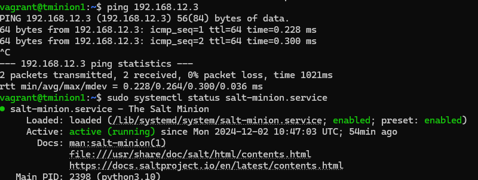

My master daemon was in inactive status, so I started it with next command. After this it was active.

    sudo systemctl start salt-master.service

After all this was done, it was time to accept keys for the minion-master -Salt connection with master-computer and test the connection

    sudo salt-key --list all
    sudo salt-key -A
    
    sudo salt '*' test.ping

Everything went good, and resulted in True -answers from minions.

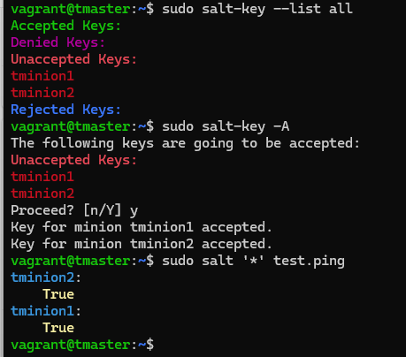

## Installing Apache2 for master 3.12.2024 17:45-18:40

First I will install Apache2 daemon for master-computer and test it using Salt commands locally. When it's working, I will use salt to install it, and it's configuration files to minion1-computer using Salt.
To do this, I will make a module directory for this daemon "project", make a Salt statement which will install apache2, make the config files and then test that it's working. I will also make a user and user directories for using apache.
Tips: https://terokarvinen.com/2018/04/10/name-based-virtual-hosts-on-apache-multiple-websites-to-single-ip-address/, https://terokarvinen.com/2018/04/03/pkg-file-service-control-daemons-with-salt-change-ssh-server-port/?fromSearch=karvinen%20salt%20ssh & https://terokarvinen.com/2018/apache-user-homepages-automatically-salt-package-file-service-example/?fromSearch=apache

First I installed apache by hand and changed the web page to test it.

    $ tmaster
    sudo apt-get update
    sudo apt-get -y install apache2

    echo "Default"|sudo tee /var/www/html/index.html # is to change the localhost Default web page from Apache. Successfully
    curl localhost # returned "Default"

Then I made the apache configuration files

    $ tmaster
    sudoedit /etc/apache2/sites-available/project1.conf

    <VirtualHost *:80>
      ServerName moduleproject.com
      ServerAlias www.moduleproject.com

              DocumentRoot /var/www/html/index.html
              <Directory /var/www/html/index.html>

                      Require all granted

              </Directory>
    </Virtualhost>

    EDITOR=micro sudoedit /var/www/html/index.html

    Try to test

Then activated the new site and restarted apache.

    sudo a2ensite project1.conf
    sudo a2dissite 000-defaul.conf
    sudo systemctl restart apache2
    
    # then check if the web page changed with

    curl localhost

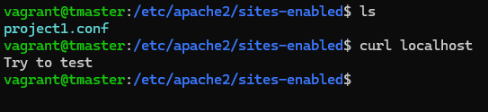

## Installing apache and files to master with salt 3.12.2024 18:45-19:20
    
When the hand-installation worked, I started with Salt. First I made the directory and went inside it. Then copied the index-file I made earlier.

    $ tmaster
    sudo mkdir -p /srv/salt/apache
    cd /srv/salt/apache/

Second I made the sls file to run the commands. I Also want to make a new apacheuser1 -user for later use, so I will make it too.

    $ tmaster
    sudoedit init.sls

   apacheuser1:
     user.present

    /srv/salt/apache/index.html:
      file.managed:
        - source: "/var/www/html/index.html"

    /srv/salt/apache/project1.conf:
      file.managed:
        - source: "/etc/apache2/sites-available/project1.conf"

    apache2:
      pkg.installed

    apache2service:
      service.running:
        - name: apache2
        - watch:
          - file: /etc/apache2/sites-available/project1.conf
          - file: /etc/apache2/sites-enabled/project1.conf

Testing

    $ tmaster
    sudo salt-call --local -l debug state.apply apache
    
End result was not what I hoped for, the service watch does not work. But otherwise, It was good so moving on.

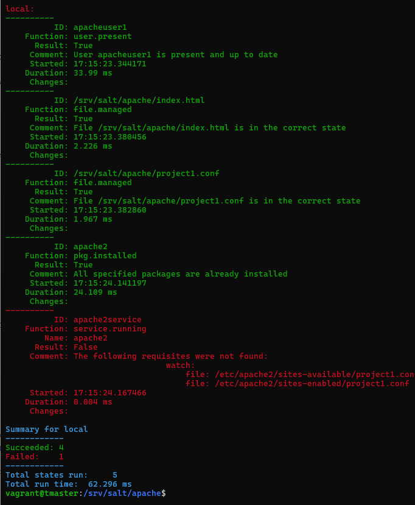

## Installing apache and files to minion1 with salt 3.12.2024 19:25-20:00

Now the salt state works locally and it is time to transit it to the minion1-computer. Still working with master, and only modifying the recently made init.sls -file in /srv/salt/apache.
Making the config files first in the master computer, will help transmitting them with the package to the minion, which will be administrating the apache2 daemon in this project. I also took away the service watch, because it did not work yet.

    $ tmaster
    sudoedit /srv/salt/apache/init.sls

    apacheuser1:
      user.present
      
      /home/apacheuser1/publicweb/index.html:
        file.managed:
          - source: "salt://apache/index.html"
          - makedirs: True
    
    apache2:
      pkg.installed
      
      /etc/apache2/sites-available/project1.conf:
        file.managed:
          - source: "salt://apache/project1.conf"

Then used salt state to idempotent.

    sudo salt 'tminion1' -l debug state.apply apache

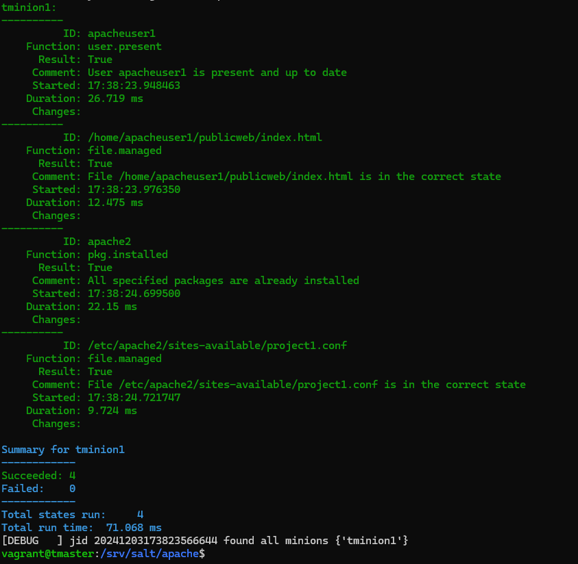

So the installations were good. Now it would be time to modify the configuration files.

If you want to modify these with $master before applying the states to the minion, it's ok. The saved files will then be made to the minion-computer. You can also edit the files after applyin the states directly in $minion, which I did.

    $ tminion1
    sudoedit /etc/apache2/sites-available/project1.conf

    <VirtualHost *:80>
      ServerName moduleproject.com
      ServerAlias www.moduleproject.com

              DocumentRoot /home/apacheuser1/publicweb/
              <Directory /home/apacheuser1/publicweb/>

                      Require all granted

              </Directory>
    </Virtualhost>

    sudoedit /home/apacheuser1/publicweb/index.html

    <!doctype html>

      <html lang="fi">
        <head>
        <meta charset="UTF-8">
        <title>Apachedrop with Salt</title>
        </head>

      <body>

        <h1>Making some code to a new html file</h1>

        
Testing scandic åäö

        
Dropped also a new user to administrate the apache

      </body>
    </html>

After making the necessary changes, I enabled the new config file and restarted the daemon.

    $ tminion1
    sudo a2ensite project1.conf
    sudo a2dissite 000-default.conf
    sudo systemctl restart apache2

Then tested the results, and it worked

    $ tminion1
    curl localhost

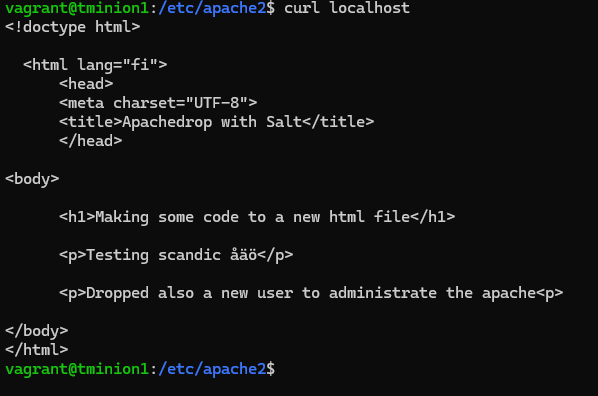
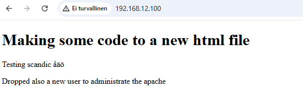

## Installing PostgreSQL 3.12.2024 20:10-01:05

Purpose is to install PostgreSQL to the second minion-computer tminion2. But first it was better to do it manually, before using salt.
So my first task was to install the package itself, make some tables and add data for the database and then check if I could connect to the database with a graphic ui.
Tips https://terokarvinen.com/2016/postgresql-install-and-one-table-database-sql-crud-tutorial-for-ubuntu/?fromSearch=postgre, https://www.pgadmin.org/download/pgadmin-4-apt/ & https://neon.tech/postgresql/postgresql-getting-started/connect-to-postgresql-database, plus `man postgresql`.

First downloading, then connecting to admin database user. Lastly making some tables and printing them

    sudo apt-get -y install postgresql # installation
    sudo -u postgres createdb vagrant # database
    sudo -u postgres createuser vagrant # databaseuser
    psql # entry to database

    vagrant=> CREATE TABLE test_table (id SERIAL PRIMARY KEY, testnumber VARCHAR(15)); # add table

    ERROR:  permission denied for schema public # so the user vagrant does not have priviledges. So I went back to the administrator user postgres

    exit
    sudo -u postgres psql
    postgres=# CREATE TABLE test_table (id SERIAL PRIMARY KEY, testnumber VARCHAR(15)); # add table
    postgres=# INSERT INTO test_table(testnumber) VALUES ('testnumber1'); # added data
    postgres=# INSERT INTO test_table(testnumber) VALUES ('testnumber2'); # added data
    postgres=# INSERT INTO test_table(testnumber) VALUES ('testnumber3'); # added data

    postgres=# SELECT * FROM test_table;

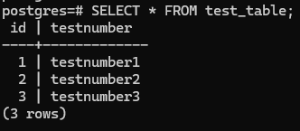

I couldn't set the user priviledges to user vagrant for it's own database. So this was the end of this at this  time.

## Dropping postgresql with salt 4.12.2024 02:10-03:40

    $ tmaster
    sudo mkdir -p /srv/salt/postgresql
    cd /srv/salt/postgresql
    
    sudoedit init.sls

    postgresql:
      pkg.installed

    sudo salt 'tminion2' -l debug state.apply postgresql
    
idempotency below

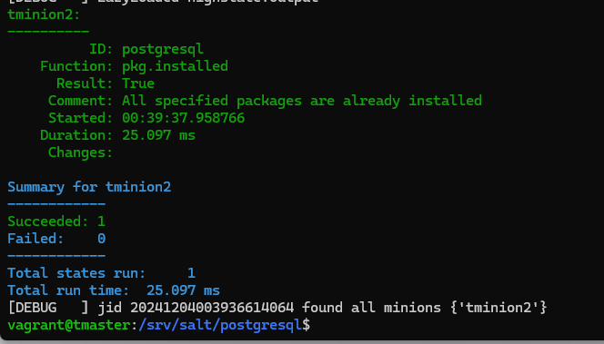

    $ tminion2

    sudo -u postgres psql
    
    postgres=# CREATE TABLE dinners (id SERIAL PRIMARY KEY, dish VARCHAR(50));
    postgres=# INSERT INTO dinners(dish) VALUES ('fish and chips');
    postgres=# INSERT INTO dinners(dish) VALUES ('peasoup');
    postgres=# INSERT INTO dinners(dish) VALUES ('chicken');
    postgres=# INSERT INTO dinners(dish) VALUES ('pizza');
    postgres=# SELECT * FROM dinners;

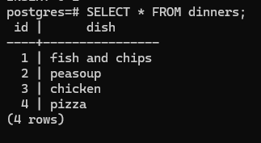

I still couldn't get a connection to the database from a client which is pgadmin.

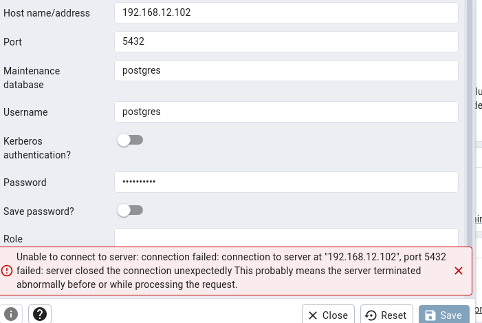

## making a top file 4.12.2024 03:45-04:10

To top it all, I made a base file to the master-computer. Just to push all these together for all necessary minions. For fun, I added a few more packages for all the minions! Tips https://terokarvinen.com/2023/salt-vagrant/#infra-as-code---your-wishes-as-a-text-file

    $ tmaster

    # for the extras
    sudo mkdir -p /srv/salt/funnies
    sudoedit /srv/salt/funnies/init.sls
    
    cowsay:
      pkg.installed

    tree:
      pkg.installed

    micro:
      pkg.installed

    # testing 
    # for the top
    sudoedit /srv/salt/top.sls

    sudo salt '*' -l debug state.apply # in the /srv/salt/ directory

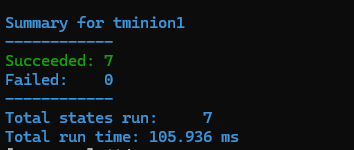 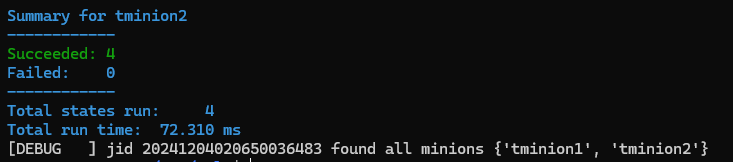

### Sources

- Karvinen, T. 2016. PostgreSQL Install one table database. https://terokarvinen.com/2016/postgresql-install-and-one-table-database-sql-crud-tutorial-for-ubuntu/?fromSearch=postgre
- Karvinen, T. 2018. Apache with Salt. https://terokarvinen.com/2018/apache-user-homepages-automatically-salt-package-file-service-example/?fromSearch=apache
- Karvinen, T. 2018. Pkg-file-service. https://terokarvinen.com/2018/04/03/pkg-file-service-control-daemons-with-salt-change-ssh-server-port/?fromSearch=karvinen%20salt%20ssh
- Karvinen, T. 2018. Nane based virtual host https://terokarvinen.com/2018/04/10/name-based-virtual-hosts-on-apache-multiple-websites-to-single-ip-address/
- Karvinen, T. 2023. Infra as a code. https://terokarvinen.com/2023/salt-vagrant/#infra-as-code---your-wishes-as-a-text-file
- Karvinen, T. 2023. Ready made vagrantfile for three computers. https://terokarvinen.com/2023/salt-vagrant/#infra-as-code---your-wishes-as-a-text-file
- Neon Tech. 2024. Connecting to a PostgreSQL server. https://neon.tech/postgresql/postgresql-getting-started/connect-to-postgresql-database
- PGAdmin. Installing PGadmin. https://www.pgadmin.org/download/pgadmin-4-apt/
- Salt repository. https://saltproject.io/blog/salt-project-package-repo-migration-and-guidance/
- Vagrant. https://developer.hashicorp.com/vagrant/install
- VirtualBox. https://www.virtualbox.org/wiki/Downloads
